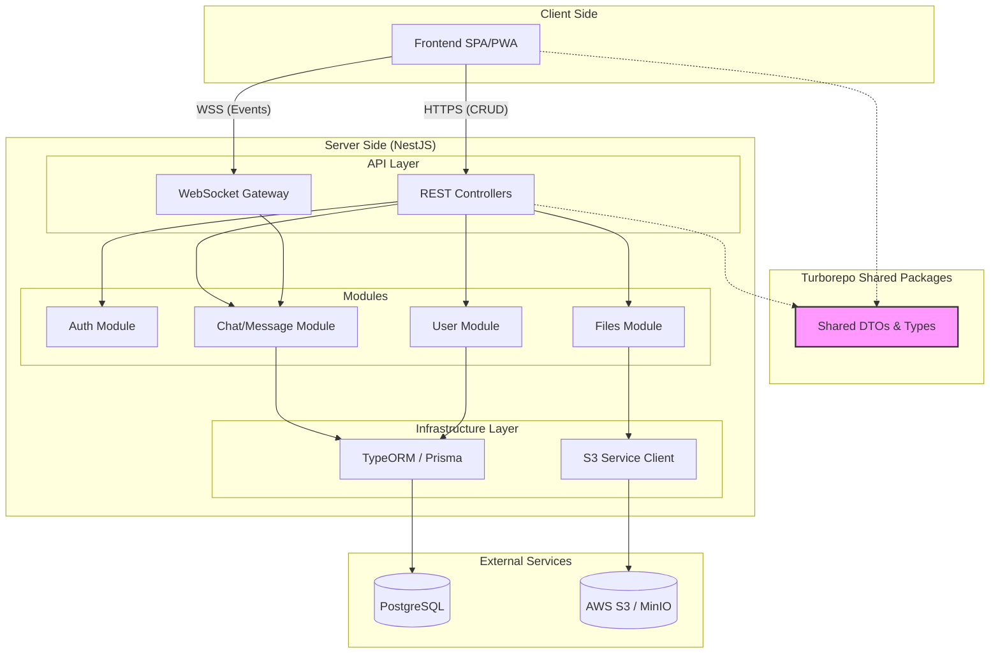
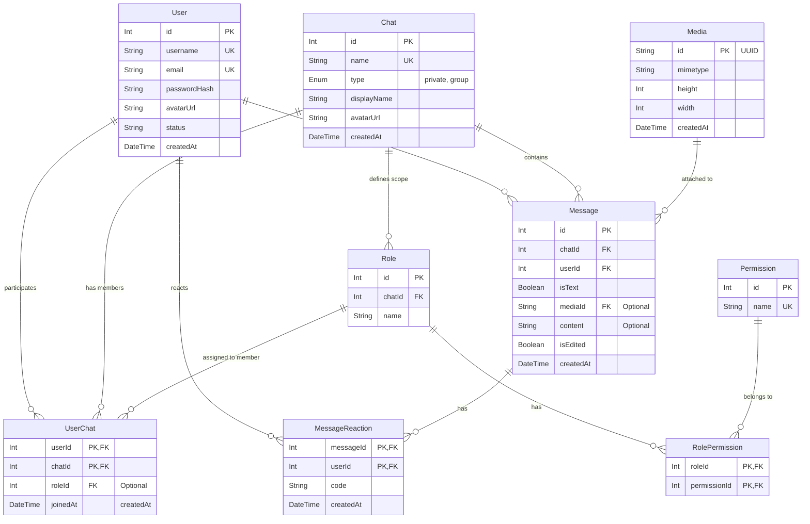

# NestChat Architecture Overview

## 1. Component Diagram (Software Component Diagram)

In a Monorepo context, the architecture is divided into three main layers: **Client Side (Frontend)**, **Server Side (Backend)**, and **Shared Libraries**.

### Key Components

- **Frontend App:** React/Next.js application.
- **API Gateway / Controller Layer:** Entry point in NestJS (REST Controllers & WebSocket Gateways).
- **Service Layer:** Business logic.
- **Data Access Layer (Repository):** Database operations.
- **Infrastructure:** Postgres, S3.
- **Shared DTO Package:** Shared interfaces.

### Component Diagram (C4 / Container Level)

**Interaction Explanation:**

- **Shared DTO:** Frontend imports request/response types. Backend uses them for validation (`class-validator`). TypeScript ensures consistency across frontend and backend.
- **REST:** Handles authorization, message history, file uploads (Multipart/form-data), and profile updates.
- **WebSockets:** Handles real-time events. Clients subscribe to events (e.g., `message_received`) to update UI without reload.

---

## 2. ER Diagram (Entity-Relationship Diagram)

Key entities: **Users**, **Chats (rooms)**, and **Messages**. Files stored in S3 are represented by links in the DB.

---

## 3. Data Flow & Scenarios

### Scenario A: Sending a Text Message

**Hybrid approach (REST + WS)**

1.  **Initiation:** User types a message and clicks "Send".
2.  **Validation (Shared):** Frontend validates via Shared DTO.
3.  **Persistence (REST):**
    - POST `/api/chats/:id/messages`
    - `ChatController` receives request
    - `ChatService` saves message in PostgreSQL

4.  **Notification (WebSocket):**
    - `ChatService` triggers `ChatGateway`
    - Gateway sends `new_message` event to all clients in the room

5.  **UI Update:** Other users receive event and update chat list in real-time (Redux/React State)

---

### Scenario B: Uploading Media File to a chat

**REST + S3 + DB**

1.  **Upload (REST):**
    - User selects file
    - Frontend sends FormData to POST `/chats/:chatId/messages/media`

2.  **Processing & Storage:**
    - `ChatService` validates image and transforms it into `webp` format
    - Streams file to AWS S3
    - S3 returns key

3.  **Update DB:**
    - Backend stores metadata about file in PostgreSQL

4.  **Response:**
    - Backend returns user object with generated pre-signed url for file
    - Optionally, WebSocket emits `user_updated` event for instant UI update
